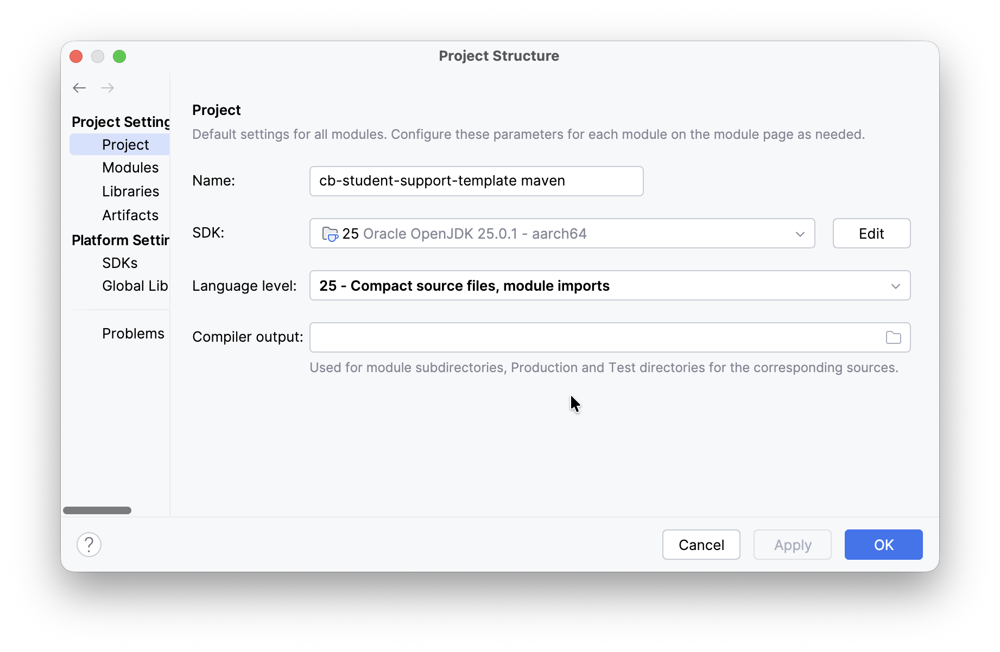
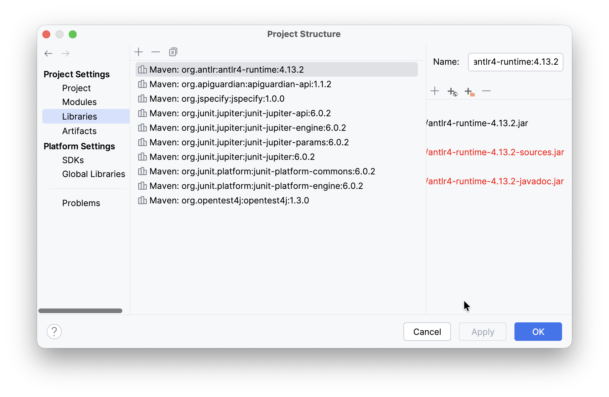
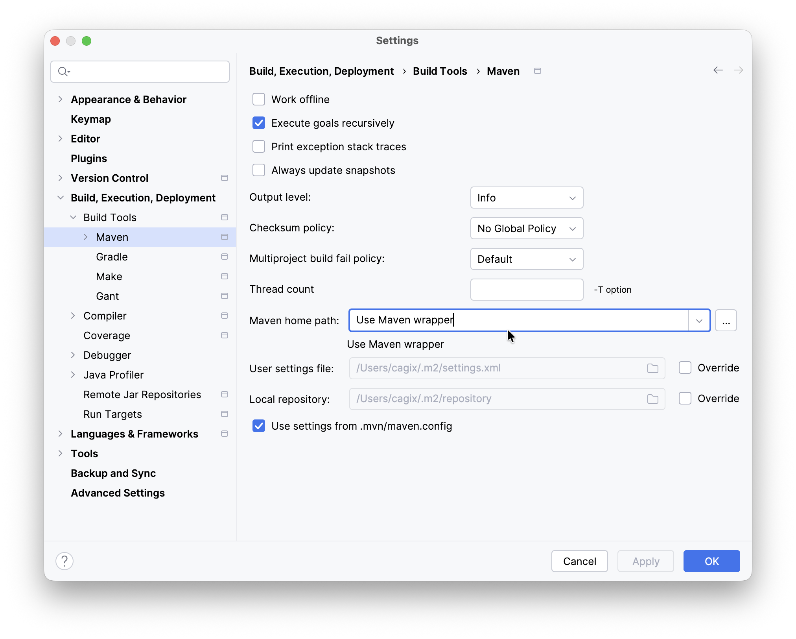
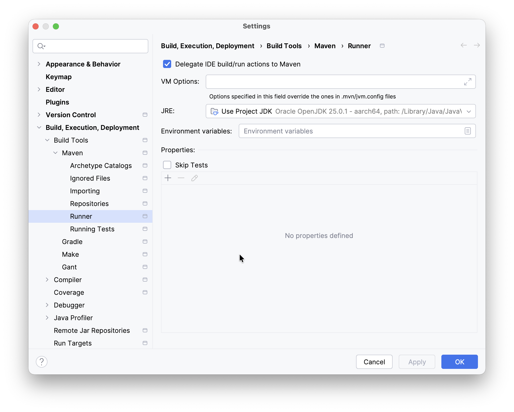

<!-- pandoc -s -f markdown -t markdown --columns=94  README.md -->

# Compiler Sample Project

Dies ist ein Starter-Projekt für die Übungsaufgaben in "Compilerbau" (Bachelor). Es existiert
eine [Maven-Konfiguration](pom.xml) (Java-Projekt), [JUnit](https://junit.org/junit6/) und
[ANTLR](https://www.antlr.org/) sind auch bereits eingebunden. Das Projekt zeigt die
Einbindung der ANTLR-Grammatiken. Zusätzlich existieren
[Beispielgrammatiken](src/main/antlr4/) für die Hello-World-Beispiele.

## Installation

Öffnen Sie den Ordner `sample_project` als neues Java-Projekt "mit existierenden Quellen" in
[IntelliJ](https://www.jetbrains.com/idea/). Achten Sie dabei darauf, dass Sie als "Build
Model" entsprechend "Maven" auswählen, damit die Konfiguration übernommen wird.

Sie benötigen ein installiertes [Java SE Development Kit **25
LTS**](https://jdk.java.net/25/). Achten Sie darauf, dass dieses auch wirklich von IntelliJ
verwendet wird (zu finden unter *Projekt-Einstellungen*).

Weitere Software ist nicht notwendig. ANTLR und JUnit werden über das Build-Skript automatisch
als Dependency heruntergeladen und eingebunden. Es empfiehlt sich dennoch, zusätzlich das
[ANTLR-Plugin für IntelliJ](https://plugins.jetbrains.com/plugin/7358-antlr-v4) zu
installieren - damit können Sie in der IDE interaktiv mit den Grammatiken experimentieren und
müssen nicht immer das gesamte Programm kompilieren und laufen lassen.

Sie können natürlich auch eine beliebige andere IDE oder sogar einen einfachen Editor
verwenden.

## Maven-Tasks

### Aufräumen

`./mvnw clean`

### Starten des Programms

Konfigurieren Sie Ihr Programm im [`pom.xml`](pom.xml) in der Definition `mainClass`.

Danach können Sie das Programm kompilieren `./mvnw compile` und starten über
`./mvnw exec:java`.

Wichtig: In Maven gehört das Plugin zum Ausführen des Programms nicht zum
Standard-Lebenszyklus bzw. ist nicht mit diesem verknüpft. Konfigurieren Sie sich in IntelliJ
eine neue Run-Configuration vom Typ "Maven" und tragen Sie im Feld `Run` den String
`compile exec:java -Dexec.mainClass=Main` ein (passen Sie `Main` entsprechend an Ihre
Main-Klasse an samt Package-Pfad).

### Formatieren

Ihre Java-Sourcen können Sie mit `./mvnw spotless:apply` formatieren.

### Testen

`./mvnw test` (nur JUnit) oder `./mvnw verify` (JUnit und Spotless)

### Grammatik neu übersetzen

Die ANTLR-Grammatiken werden im Ordner [`src/main/antlr4`](src/main/antlr4/) erwartet. Sie
werden standardmäßig beim Bauen der Applikation übersetzt, also beispielsweise beim Ausführen
von `./mvnw compile`.

Die dabei generierten Dateien werden im Build-Ordner
[`target/generated-sources/antlr4/`](target/generated-sources/antlr4/) abgelegt und sind über
die Maven-Konfiguration automatisch im Classpath verfügbar.

Falls Ihre Grammatik in einem Package liegt (beispielsweise
[`HelloPackage.g4`](src/main/antlr4/my/pkg/HelloPackage.g4) im Package `my.pkg`), dann wird
für die generierten Sourcen im Build-Ordner automatisch dieses Package mit angelegt. Wichtig:
Bei Maven brauchen Sie hier keine Direktive `@header` mit der entsprechenden
Package-Deklaration in der Grammatik (also anders als bei der Gradle-Variante).

Wenn Sie die Grammatik einzeln übersetzen wollen, können Sie dies mit `./mvnw antlr4:antlr4`
tun.

> [!TIP]
> **Hinweis**: Sie werden in Ihrem eigenen Code Abhängigkeiten zu (bzw. Importe von)
> generierten Klassen haben. IntelliJ wird deshalb beim Start entsprechende Fehler anzeigen -
> die generierten Klassen existieren ja in einem frischen Projekt noch nicht! Diese werden
> erst beim Build (`./mvnw compile`) bzw. beim expliziten Aufruf von `./mvnw antlr4:antlr4`
> erzeugt. Danach sind dann auch die Fehlermeldungen weg ... Bei einem `./mvnw clean` werden
> auch die generierten Sourcen mit entfernt, weshalb es danach bis zum ersten Build oder Run
> wieder Fehlermeldung bzgl. der ANTLR-Dateien gibt.

> [!IMPORTANT]
> **Hinweis**: Sorgen Sie dafür, dass Ihre IDE tatsächlich auch die Projekteinstellungen von
> Maven übernommen hat und auch mit Maven baut!
>
> Check, ob die **Projekteinstellungen** in IntelliJ passen:
> 1.  Menü `File > Project Structure > Project Settings > Project` sollte für Ihr Projekt als
>     SDK ein "Java 25" zeigen: 
> 2.  Menü `File > Project Structure > Project Settings > Libraries` sollte für Ihr Projekt
>     Jar-Files für ANTLR4 zeigen: 
>
> Check, ob **IntelliJ mit Maven baut**:
> 1.  Menü `IDEA > Settings > Build, Execution, Deployment > Build Tools > Maven` sollte auf
>     den Maven-Wrapper umgestellt sein: 
> 2.  Menü `IDEA > Settings > Build, Execution, Deployment > Build Tools > Maven > Runner`
>     sollte der Schalter "Delegate IDE build/run actions to Maven" aktiviert sein:
>      und unter "JRE" sollte das für das Projekt verwendete
>     JRE eingestellt sein, d.h. aktuell Java 25.

## License

This [work](https://github.com/Compiler-CampusMinden/student-support-code-template-maven) by
[Carsten Gips](https://github.com/cagix) and
[contributors](https://github.com/Compiler-CampusMinden/student-support-code-template-maven/graphs/contributors)
is licensed under [MIT](LICENSE.md).
